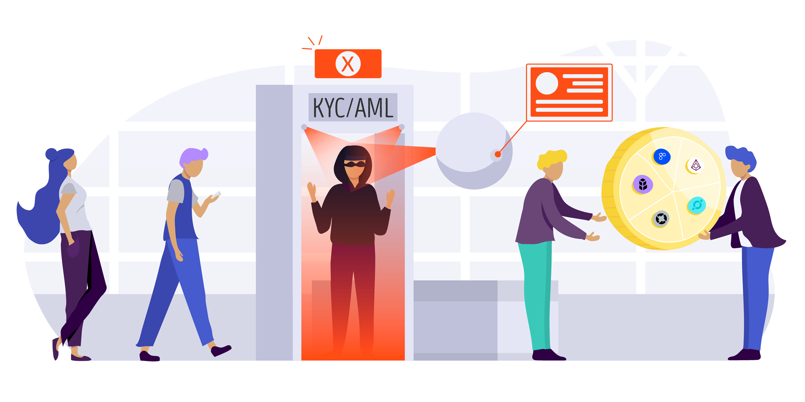

# Basket Protocol: KYC Version



[](https://jenkins.coinalpha.com/job/kyc-basket-protocol/)
[](https://coveralls.io/github/CoinAlpha/kyc-basket-protocol?branch=master)

This branch builds off of CoinAlpha's base [Basket Protocol](https://github.com/CoinAlpha/basket-protocol).

## Quick Reference

Name | Description
---|---
[Basket Protocol](https://github.com/CoinAlpha/basket-protocol) | CoinAlpha's Basket Protocol used as a base for this repo.  For more information on the protocol's base functions, please go to the [Basket Protocol repo](https://github.com/CoinAlpha/basket-protocol).
[CoinAlpha Releases KYC-Enabled Version of Basket Protocol](https://medium.com/finance-3/coinalpha-releases-kyc-enabled-version-of-basket-protocol-10a99e3b13ac) | Blog post discussing regulatory considerations and motivation for the creation of this KYC Version of the Basket Protocol.
[KYC.sol](contracts/KYC.sol) | A new smart contract module introduced in this version of the Basket Protocol that implements whitelisting rules and functionality.
`KYC Admin` | Ethereum address of a user, who in addition to the protocol creator/administrator, has the ability to whitelist Ethereum addresses.

## Overview
This KYC version of the Basket Protocol adds whitelisting functionality: a protocol administrator (`owner`) and another authorized party, the `KYC Admin`, have the ability to whitelist Ethereum addresses that will be permitted to hold Basket Tokens.

Only Ethereum addresses that have been whitelisted will be able to hold Basket Tokens; any transfers to or transactions that would involve a transfer to a non-whitelisted address are not permitted and will fail.


### KYC Whitelist Module

The [KYC.sol](contracts/KYC.sol) contract is introduced in this version of the Basket Protocol to implement the whitelisting functionality.

The main functions are summarized below:

```js
// Query if an address is whitelisted
function isWhitelistedHolder(address _holder) public view returns (bool)
```

```js
// Function to whitelist an Ethereum address
function whitelistHolder(address _addressToWhitelist) public onlyOwnerOrAdmin returns (bool) 
```

```js
// Function to remove an address from the whitelist
function unWhitelistHolder(address _addressToUnwhitelist) public onlyOwnerOrAdmin returns (bool)
```

**Dependencies on KYC.sol**

The contracts which involve potential transfers of Baskets Tokens (namely [Basket.sol](contracts/Basket.sol) and, indirectly, [BasketEscrow.sol](contracts/BasketEscrow.sol) - via its interaction with [Basket.sol](contracts/Basket.sol)) connect to [KYC.sol](contracts/KYC.sol) to verify validity of the recipient Ethereum address.


---


## Testing
- [Truffle](http://truffleframework.com/) [v4.1.5](https://github.com/trufflesuite/truffle/releases/tag/v4.1.5)

```sh
$ truffle install -g truffe@4.1.5
Truffle v4.1.5 (core: 4.1.5)
Solidity v0.4.21 (solc-js)
```

**Run test**

```sh
$ npm test
```

**Running test coverage (solidity-coverage)**

```sh
# Requires environment variable TEST_COVERAGE=true, which is set in the npm script:
npm run coverage
```

## Deployment

- Specify `DEPLOYER_ADDRESS` and `KYC_ADMIN` address in [config.js](config.js)

```sh
# Ropsten Deployment
npm run deploy:ropsten
# Mainnet Deployment
npm run deploy:mainnet
```


## Security
The CoinAlpha team, to the extent possible, aims to follow industry best practices and keep up to date with the rapidly developing field of smart contracts and blockchain engineering.  Some of the guides and best practices followed include:
- [OpenZeppelin contracts](https://github.com/OpenZeppelin/zeppelin-solidity): the Basket Protocol uses some of the standardized and widely accepted OpenZeppelin contracts
- [ConsenSys: Smart Contract Security Best Practices](https://github.com/ConsenSys/smart-contract-best-practices)


### 🐞 Bug Bounty Program
We are also running a bug bounty program.
If you find a security issue, please email [dev@coinalpha.com](mailto:dev@coinalpha.com).
For more information on the Bug Bounty program, click here: [Basket Protocol Bug Bounty Program](https://medium.com/finance-3/cryptobaskets-hosho-security-audit-bug-bounty-program-24311c22a9d6)


## Contributions Are Welcome!
- [Contributing](CONTRIBUTING.md): git workflow

We welcome code contributions (via [pull requests](https://github.com/CoinAlpha/basket-protocol/pulls)) as well as bug reports and feature requests through [github issues](https://github.com/CoinAlpha/basket-protocol/issues).  You may also contact us by [email](mailto:dev@coinalpha.com).

## Contact
The Basket Protocol was created by [CoinAlpha](https://www.coinalpha.com).  You can contact us at [dev@coinalpha.com](mailto:dev@coinalpha.com).

## License
Code released under the [Apache-2.0 License](LICENSE).
